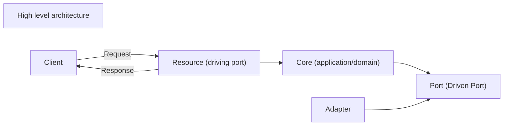

# Small banking application using Spring Boot

## Overview
This is a small application supporting two use cases.
1. Create a new account for an existing customer. If initial balance is not 0 then a transaction is automatically
created.
2. Fetch customer information along with the associated accounts

The application is designed using Hexagonal Architecture and Domain-Driven Design-principles to achieve a foundation
where new use cases can be added later on.



Short breakdown
* The core (application and domain) defines ports (outgoing or driven) which it needs to fulfill its purpose.
  * application - uses the domain-services to fulfill certain use cases
  * domains
    * customer
    * account
    * transaction
* adapter.out consists of the implementations of outgoing (or driven) adapters, in this case Hibernate.
* adapter.in consists of the implementations of incoming (or driving) adapters.

## Test
Follow these steps to test the application

1. Build the application
``
./gradlew build
``

2. Start the application (runs on port 8080)
``
./gradlew bootRun
 ``

When the application starts two customers are inserted (using TestDataLoader.java). 
Go to http://localhost:8080/h2-console and log in with username SA (no password required) to see available customers.

### Use case 1
To add an account use the following request:
```
curl --request POST 'http://localhost:8080/v1/account' \
--header 'Content-Type: application/json' \
--data-raw '{
"customerId": "{customerId}",
"initialCreditInCents": 1
}'
```

If successfully processed the response while like like this:
```
{
    "status": 201,
    "accountId": "5bda688b-9a96-4ac2-886e-cd8c5c82293d"
}
```

If the customer does not exist it will look like this:
```
{
    "status": 422,
    "error": "Customer with id '9ab16c13-4c90-4091-8729-e4de20b33496' does not exist"
}
```

### Use case 2
To fetch information about a customer use the following request:
```
curl --request GET 'http://localhost:8080/v1/customer/{customerId}'
```

The response should like this:
```
{
    "name": "Name1",
    "surname": "Surname1",
    "accounts": [
        {
            "accountId": "5bda688b-9a96-4ac2-886e-cd8c5c82293d",
            "balanceInCents": 1,
            "transactions": [
                {
                    "id": "f43b508c-0718-441d-a227-412f1041e88c",
                    "type": "INCOMING",
                    "amount": 1,
                    "timestamp": "2024-05-29T16:17:36.861279",
                    "description": null
                }
            ]
        },
        {
            "accountId": "940f93b2-49be-4315-a721-f534f1c786b6",
            "balanceInCents": -1,
            "transactions": [
                {
                    "id": "75c6bd31-30e8-4c4f-99c2-a94528d79c39",
                    "type": "OUTGOING",
                    "amount": 1,
                    "timestamp": "2024-05-29T16:19:15.894079",
                    "description": null
                }
            ]
        },
        {
            "accountId": "6b05b417-52a1-495c-a80c-589a989c401d",
            "balanceInCents": 0,
            "transactions": []
        }
    ]
}
```


